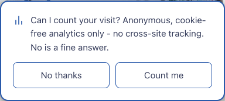

# @vdaluz/astro-opt-in-analytics

[](https://github.com/vdaluz/astro-opt-in-analytics/actions/workflows/ci.yml)

Consent-first analytics for Astro. The tracker script does not exist on the page until the visitor says yes: no requests, no fingerprinting surface, nothing to block. An opt-in prompt asks once, the answer is remembered, and refusing is exactly as easy as accepting.

Built for [Umami](https://umami.is) first, with a small adapter interface for other trackers. Ships raw `.astro` and `.ts` - the consuming app's Astro/Vite compiles them (no prebuild step). Proven in production on [vdaluz.com](https://vdaluz.com) and [imperfectsystems.com](https://imperfectsystems.com) - see [Consumers](#consumers).

## Why opt-in

Most "privacy-respecting analytics" setups still track by default and put the burden of blocking on the visitor. This package flips the default: tracking is off until a real yes. That costs you data. That is the point.

- **Zero requests until consent.** The script tag is injected only after a stored grant. Denied or unanswered means it never exists.
- **[Global Privacy Control](https://globalprivacycontrol.org/) is an answer.** `navigator.globalPrivacyControl === true` counts as a no. The prompt never shows; asking again would be its own dark pattern.
- **Anti-dark-pattern by construction.** Equal-weight buttons, decline first in DOM order, Esc or dismissal means deny, no overlay, no scroll lock. These are hard-coded, not configurable.
- **Changeable, both directions.** `openConsentPrompt()` (or any element with `data-open-analytics-prompt`) reopens the prompt, e.g. from a footer "Analytics preferences" link.

## Install

Pinned https tarball from a tag (no registry needed):

```jsonc
// package.json
"dependencies": {
  "@vdaluz/astro-opt-in-analytics": "https://github.com/vdaluz/astro-opt-in-analytics/archive/refs/tags/v0.5.1.tar.gz"
}
```

> **Why a tarball, not `github:...`?** npm canonicalizes GitHub shorthand to `git+ssh://` in the lockfile, and CI runners without SSH keys fail to clone it. The archive URL is anonymous https with an integrity hash. Bump the tag in the URL to upgrade. This is the only supported install path; there's no npm registry package (tag-tarball works for anyone, no registry auth needed).

Peer dependency: `astro` >= 6.

## Use

```ts
// src/config/analytics.ts
import { defineAnalyticsConfig, umami } from '@vdaluz/astro-opt-in-analytics';

export const analytics = defineAnalyticsConfig({
  tracker: umami({
    src: 'https://umami.example.net/script.js',
    websiteId: '00000000-0000-0000-0000-000000000000',
    extra: { 'data-exclude-search': 'true' },
  }),
  prompt: {
    message: 'Can I count your visit? Anonymous, cookieless, self-hosted analytics. No is a fine answer.',
    accept: 'Count me',
    decline: 'No thanks',
  },
});
```

```astro
---
// src/layouts/Layout.astro
import ConsentGate from '@vdaluz/astro-opt-in-analytics/ConsentGate.astro';
import ConsentPrompt from '@vdaluz/astro-opt-in-analytics/ConsentPrompt.astro';
import { analytics } from '../config/analytics';
---
<!-- Gate before prompt, both once per page -->
<ConsentGate config={analytics} />
<ConsentPrompt config={analytics} />
```

Footer link, no JS required:

```html
<button type="button" data-open-analytics-prompt>Analytics preferences</button>
```

### Example

`ConsentPrompt` live on vdaluz.com, first visit, no stored decision:



## Privacy explainer page

`PrivacyExplainer.astro` renders the substantive sections of a `/privacy` page - what's collected, how consent gates it, and which tools are behind it - sourced directly from your `analytics` config so the page can't drift from what's actually injected. Wrap it in your own layout and hero copy:

```astro
---
// src/pages/privacy.astro
import Layout from '../layouts/Layout.astro';
import PrivacyExplainer from '@vdaluz/astro-opt-in-analytics/PrivacyExplainer.astro';
import { analytics } from '../config/analytics';
---
<Layout title="Privacy & Analytics">
  <h1>Privacy &amp; analytics</h1>
  <PrivacyExplainer config={analytics} locale={Astro.currentLocale} />
</Layout>
```

The "tools behind it" list only shows trackers that carry a `privacyInfo` field. Both bundled adapters set a sensible default - `umami()` points at [umami.is/privacy](https://umami.is/privacy), `cloudflareBeacon()` at [cloudflare.com/web-analytics](https://www.cloudflare.com/web-analytics/) - override `privacyInfo` per adapter call to customize the label or add a `description` clause about your specific deployment (e.g. "that I run myself, on my own infrastructure"). A tracker with no `privacyInfo` is simply omitted from the list.

## Cloudflare Web Analytics

`cloudflareBeacon({ token })` builds the manual (non-auto-injected) beacon script tag, gated by consent like any other adapter:

```ts
import { cloudflareBeacon } from '@vdaluz/astro-opt-in-analytics';

cloudflareBeacon({ token: '00000000000000000000000000000000' });
```

This requires switching off Cloudflare's edge auto-injection for the zone (dashboard: Web Analytics → Manage Site → enable "JS snippet installation") - otherwise the auto-injected beacon loads unconditionally alongside this one, bypassing consent.

## How it works

1. `ConsentGate` reads a versioned record from localStorage (`opt-in-analytics:consent`). Grant: the tracker `<script>` is injected. Anything else: nothing loads. `tracker` also accepts an array of adapters; one grant injects all of them (e.g. Umami plus a manually-installed Cloudflare Web Analytics beacon), and the prompt copy should disclose every tracker it covers.
2. `ConsentPrompt` shows only when there is no decision and no GPC signal. The answer is stored as `{ v, decision, at }`.
3. Bump `consentVersion` in your config when what you track changes; older stored decisions re-prompt.
4. A denial after a grant applies from the next navigation (the already-loaded script is not surgically removed; nothing new ever loads).

## Styling

The prompt reads CSS custom properties with sensible dark fallbacks: `--surface`, `--fg`, `--border`, `--accent`, `--on-accent`. Same token contract as [@vdaluz/astro-blog](https://github.com/vdaluz/astro-blog): values are **R G B channel triplets** (e.g. `--surface: 26 26 26;`), consumed as `rgb(var(--name))`. If your app already defines those, the prompt matches your theme with zero extra CSS.

## Consumers

- [vdaluz.com](https://vdaluz.com)
- [imperfectsystems.com](https://imperfectsystems.com)

## Contributing

Issues welcome. PRs by discussion - open an issue first for anything beyond a typo or docs fix.

## License

MIT
